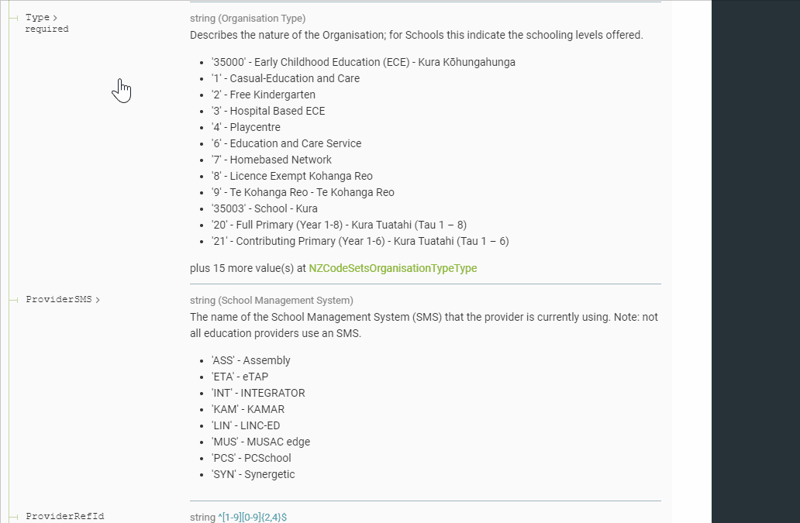
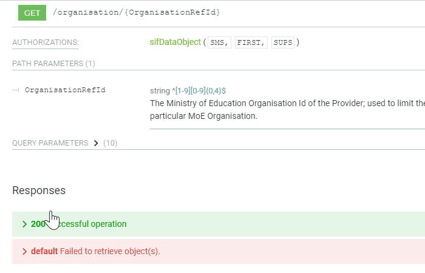
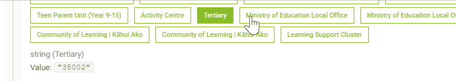
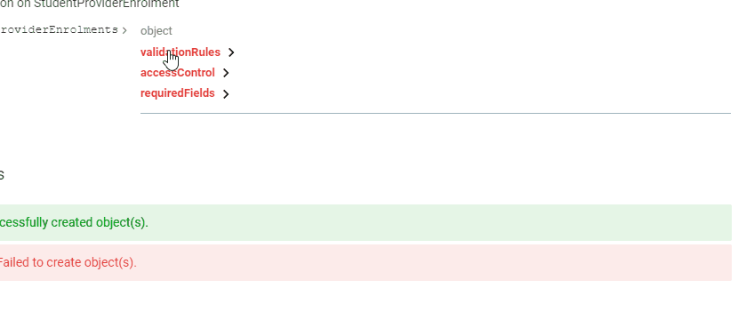
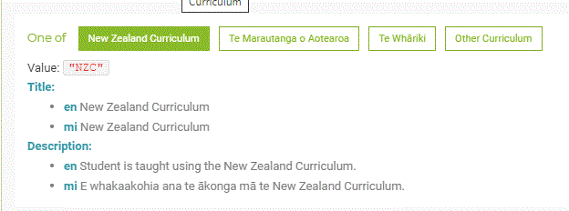

# MoE Customisations to ReDoc

This fork of [ReDoc v2.0.0-rc.40](https://github.com/Redocly/redoc/tree/v2.0.0-rc.40) has the following customisations:

- [JSON Schema `const`](#json-schema-const)
- [Long Enumerations](#long-enumerations)
- [Large Parameter Groups](#large-parameter-groups)
- [JSON Schema `x-deferred`](#json-schema-deferred-fields)
- [JSON Schema `x-startDate` & `x-endDate`](#json-schema-effective-dates)
- [Vendor Extensions Display](#vendor-extensions-display)
- [Multi Lingual Annotations](#multi-lingual-annotations)
- [New Configuration Options](#new-configuration-options)
- [$ref implied allOf for Annotations](#ref-implied-allOf-for-annotations)

## Development
see [CONTRIBUTING.md](CONTRIBUTING.md) to read the original guidelines on development of this [React](https://en.wikipedia.org/wiki/React_(web_framework)) application

### Commonly used Yarn/NPM scripts

``` bash
# dev-server, watch and auto reload playground
$ yarn start

# runt tslint
$ yarn lint

# try autofix tslint issues
$ yarn lint --fix

# run unit tests
$ yarn unit

# prepare bundles
$ yarn bundle

# put bundles into place for redoc-cli
$ yarn bundle:cli
```

There are some other scripts available in the `scripts` section of the `package.json` file.

## New Configuration Options

Many of these customisations are controlled by new configuration options.
- `defaultLanguage`  (default 'en') denotes which language key will be used when generating documentation; ie: title*['en] will be promoted into 'title' field.

- `oneOfSuppressionThreshold` (default 30)  enumerations with at least this many members will not be fully described; as they are too long to be useful.  Click on the little red 'more...' to see all available values.  See [Long Enumerations](#long-enumerations)

- `parameterGroupCollapseThreshold` (default 6) parameter groups with more than this many members
will be collapsed on initial display.  Click on the group heading to expand.  See [Large Parameter Groups](#large-parameter-groups)


## JSON Schema Const
- JSON Schema uses keyword `const` as short hand for a single `enum` value, which allows us to have titles and description fields for each enumeration value, thus:
``` JSON
  NZCodeSetsGender:
    type: string
    title: Gender
    description: >-
      <p>A Person may identify as having a Gender (or Gender Identity). Biological sex and sexual orientation are related but
      different concepts. Sourced from Statistics NZ Standard for Gender Identity</p>
    oneOf:
    - const: '1'
      title: Male
    - const: '2'
      title: Female
    - const: '3'
      title: Gender Diverse
      description: But not further defined
    - const: '31'
      title: Transgender Male to Female
      description: 'Can be rolled up to 3:Gender Diverse'
    - const: '32'
      title: Transgender Female to Male
      description: 'Can be rolled up to 3:Gender Diverse'
    - const: '9'
      title: Not Willing to Disclose
```

## Long Enumerations
Enumerations that have been constructed with `oneOf` and `const` can be very long.  Long enumerations are initially displayed with only `options.oneOfSuppressionThreshold` (default 30) members. Clicking on the little red `more...` button will remove the truncation.

 

## Large Parameter Groups
Parameters groups (eg: Query Parmeters in complex APIs) with more than `options.parameterGroupCollapseThreshold` (default 6) members will be collapsed on initial load.
Click on the heading to expand.

 

## JSON Schema deferred fields
- Fields in JSON Schema can be marked as `x-deferred` meaning the fields is deferred, but it will be used in the near future, although currently
  they are not to be used.  The `deferred` marking is displayed under the field name similar to the `required` marking.

## JSON Schema effective dates
- Fields in JSON Schema can be marked with `x-startDate` and `x-endDate` defining the dates from
which and/or until which the field is valid.  This is intended to allow for code values to change
within enumerations; but can be used to record arrival and deprecation of individual field values. 

 
 
## Vendor Extensions Display
- Vendor extension fields (ones with `x-` prefix) are displayed as follows
  - If field is a JSON object, it is displayed in a code block, using [json-stringify-pretty-compact](https://www.npmjs.com/package/json-stringify-pretty-compact)
  - If field is a string, it is treated as markdown

- Vendor extension fields are initially displayed collapsed - just click on the label to expand.

  


## Multi Lingual Annotations
Keywords `title*` and `description*` can be used instead of `title` and `description`;  they are multi-lingual string maps, using 
ISO standard language codes as keys; allowing for multiple versions of the same title or description in different languages.  For Example:

``` JSON
      const: TMA
      title*:
        en: Te Marautanga o Aotearoa
        mi: Te Marautanga o Aotearoa
      description*:
        en: Student is taught using Te Marautanga o Aotearoa.
        mi: E whakaakohia ana te ākonga mā Te Marautanga o Aotearoa.
```
Such multi-lingual titles and descriptions are displayed thus:
 


 ## $ref Implied allOf for Annotations
 Where keyword `$ref` is used to pick-up an element definition treat it as though there is an implied `allOf` so that a definition:

 ``` JSON
 NZCodeSetsGender:
    type: string
    title: Gender
    description: >-
      <p>A Person may identify as having a Gender (or Gender Identity). Biological sex and sexual orientation are related but different concepts. Sourced from Statistics NZ Standard for Gender Identity</p>
    oneOf:
    - const: '1'
      title: Male
    - const: '2'
      title: Female
    - const: '3'
      title: Gender Diverse
      description: But not further defined
    - const: '31'
      title: Transgender Male to Female
      description: 'Can be rolled up to 3:Gender Diverse'
    - const: '32'
      title: Transgender Female to Male
      description: 'Can be rolled up to 3:Gender Diverse'
    - const: '9'
      title: Not Willing to Disclose
 ```

 Can be used, and have the annotation field `description` adjusted:

``` JSON
 properties:
    gender:
      $ref: '#/definitions/NZCodeSetsGender'
      description:  The Student's gender identity; defined from NZ Statistics standard for Gender Identity.
```

Field definitions tend to have somewhat generic descriptions that need to be more specifically
described where the generic field is actually used.